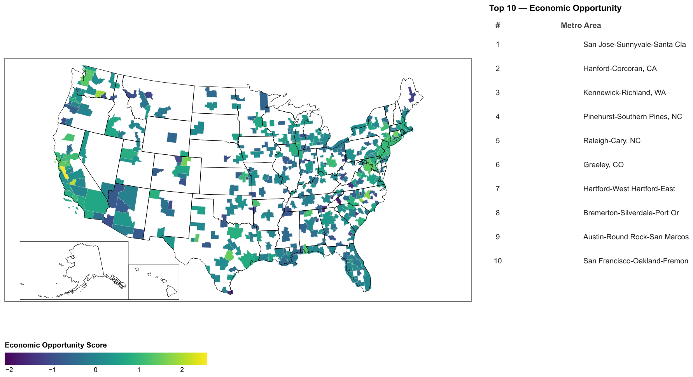
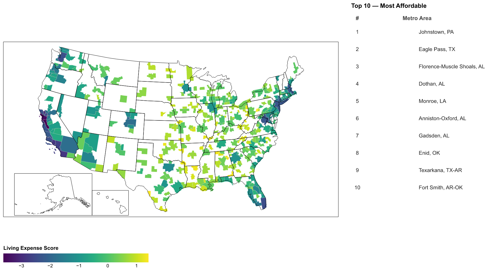
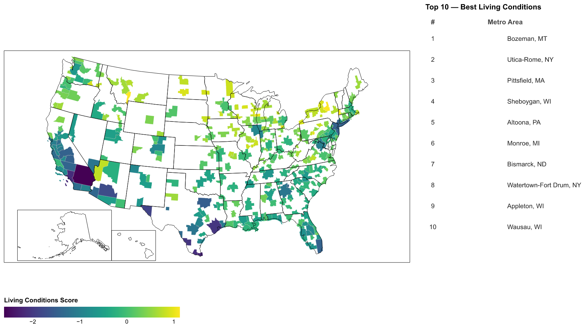

**Group Members:** Peiwen Zhang (GitHub: `pwienzzz`) | Han Zhang (GitHub: `hanz12138`)

## Research Question

Which U.S. metropolitan areas are most attractive for recent college graduates, considering economic opportunity, cost of living, and quality of life? Rather than relying on a single fixed metric, we construct a composite index that allows individuals to weight these three dimensions according to their own priorities — recognizing that a graduate prioritizing career growth has fundamentally different needs than one optimizing for affordability or livability.

## Approach and Coding

We assembled five datasets covering U.S. metropolitan statistical areas (MSAs): **Census ACS** (median income by educational attainment, median rent, commute time, health insurance coverage, occupants per room), **EPA AQI** (annual median Air Quality Index), **BEA Regional Price Parities** (cost-of-living index), **BLS QCEW** (year-over-year employment growth), and **Census TIGER/Line Shapefiles** (CBSA boundaries).

All datasets were cleaned in Python (`pandas`) and merged on CBSA codes. A key challenge was harmonizing identifiers across sources: BLS uses a format requiring numeric transformation (`area_fips[1:] × 10`), BEA embeds quotes in `GeoFIPS`, and the Census uses a 5-character string in `GEO_ID`. After harmonizing, we obtained a merged dataset of approximately 900 metro areas.

Each indicator was standardized using z-scores. Indicators where a higher raw value represents a worse outcome (rent, price parity, AQI, commute time, occupants per room) were negated so higher z-scores consistently indicate better outcomes. Three sub-scores were computed: **Economic Opportunity** (average of income and employment growth z-scores), **Affordability** (average of rent and price parity z-scores), and **Quality of Life** (average of AQI, commute time, insurance coverage, and occupants-per-room z-scores). A **Final Attractiveness Score** is their weighted average with user-defined weights.

**Difficulties encountered:** Employment growth and AQI data were missing for a meaningful share of smaller metros. Deploying `geopandas` on Streamlit Cloud required managing system-level GDAL dependencies that differ from the local conda environment.

```{python}
import os
os.environ['PROJ_DATA'] = '/opt/miniconda3/envs/ps6env/share/proj'
os.environ['PROJ_LIB']  = '/opt/miniconda3/envs/ps6env/share/proj'

import warnings
warnings.filterwarnings('ignore')

import json
import urllib.request
import numpy as np
import pandas as pd
import geopandas as gpd
import altair as alt
import vl_convert as vlc
import matplotlib.pyplot as plt
import matplotlib.image as mpimg

try:
    import seaborn as sns
except ImportError:
    pass  # seaborn not available in this environment
```

```{python}
metro_data = pd.read_csv('data/derived data/metro_data.csv')
pollution  = pd.read_csv('data/derived data/pollution.csv')
rpp        = pd.read_csv('data/derived data/BEA_Metro_RPP_2024_Clean.csv')
emp        = pd.read_csv('data/derived data/Cleaned_MSA_Employment_Growth.csv')

metro_data['CBSA'] = metro_data['GEO_ID'].str[-5:]

rpp['CBSA'] = rpp['GeoFIPS'].str.replace('"', '', regex=False).str.strip()
rpp_all = (rpp[rpp['Description'].str.strip() == 'RPPs: All items']
           [['CBSA', '2024']]
           .rename(columns={'2024': 'regional_price_parity'}))

emp['CBSA'] = (emp['area_fips'].str[1:].astype(int) * 10).astype(str).str.zfill(5)
emp_clean = (emp[['CBSA', 'oty_month3_emplvl_pct_chg']]
             .rename(columns={'oty_month3_emplvl_pct_chg': 'employment_growth'}))

df = metro_data.merge(pollution[['GEO_ID', 'Median_AQI']], on='GEO_ID', how='left')
df = df.merge(rpp_all,   on='CBSA', how='left')
df = df.merge(emp_clean, on='CBSA', how='left')

print(f"Dataset shape: {df.shape}")
print(f"Columns: {list(df.columns)}")
```

```{python}
def z_score(series):
    return (series - series.mean()) / series.std()

df['income_z']            = z_score(df['bachelor_degree'])
df['employment_growth_z'] = z_score(df['employment_growth'])

df['rent_z']          = z_score(df['median_rent'])
df['price_parity_z']  = z_score(df['regional_price_parity'])

df['AQI_z']               = z_score(df['Median_AQI'])
df['commute_time_z']      = z_score(df['avg_commute_time'])
df['insurance_z']         = z_score(df['insurance_coverage_rate'])
df['occupants_per_room_z']= z_score(df['avg_occupants_per_room'])
```

```{python}
df['rent_z']               = -df['rent_z']
df['price_parity_z']       = -df['price_parity_z']
df['AQI_z']                = -df['AQI_z']
df['commute_time_z']       = -df['commute_time_z']
df['occupants_per_room_z'] = -df['occupants_per_room_z']
```

```{python}
df['economic_opportunity_score'] = (
    df['income_z'] +
    df['employment_growth_z']
) / 2

df['living_expense_score'] = (
    df['rent_z'] +
    df['price_parity_z']
) / 2

df['living_conditions_score'] = (
    df['AQI_z'] +
    df['commute_time_z'] +
    df['insurance_z'] +
    df['occupants_per_room_z']
) / 4

score_cols = ['economic_opportunity_score',
              'living_expense_score',
              'living_conditions_score']
print(df[['NAME'] + score_cols].dropna().head(8).to_string(index=False))
```

```{python}
cbsa_shp = gpd.read_file('data/map/tl_2023_us_cbsa/tl_2023_us_cbsa.shp')
map_df   = cbsa_shp.merge(df, left_on='CBSAFP', right_on='CBSA', how='left')
map_df   = map_df.cx[-130:-60, 23:52].to_crs('EPSG:4326')
map_df   = map_df.rename(columns={'NAME_y': 'metro_name'})

_url = ('https://raw.githubusercontent.com/'
        'PublicaMundi/MappingAPI/master/data/geojson/us-states.json')
with urllib.request.urlopen(_url, timeout=15) as _r:
    states_features = json.loads(_r.read())['features']

print(f"Map GeoDataFrame: {len(map_df)} CBSA regions")
```

```{python}
def _clean(name):
    if pd.isna(name):
        return ''
    for s in [' Metro Area', ' Metropolitan Statistical Area',
              ' Micropolitan Statistical Area']:
        name = name.replace(s, '')
    return name.strip()


def _table_chart(column, table_title, ascending=False):
    """Altair mark_text top-10 table (pure Altair, no matplotlib)."""
    top10 = (map_df[['metro_name', column]]
             .dropna()
             .sort_values(column, ascending=ascending)
             .head(10)
             .reset_index(drop=True))
    top10['rank'] = [str(i + 1) for i in range(len(top10))]
    top10['city'] = top10['metro_name'].apply(_clean).str[:28]
    top10['row']  = list(range(len(top10)))

    src = alt.Data(values=top10[['rank', 'city', 'row']].to_dict('records'))

    def col(field, w, align, header):
        return (alt.Chart(src)
                .mark_text(align=align, baseline='middle',
                           fontSize=9.5, color='#222222',
                           dx=3 if align == 'left' else
                             (-3 if align == 'right' else 0))
                .encode(y=alt.Y('row:O', axis=None), text=f'{field}:N')
                .properties(width=w, height=310,
                            title=alt.TitleParams(text=header, fontSize=10,
                                                  fontWeight='bold',
                                                  color='#444')))

    return alt.hconcat(
        col('rank', 22,  'center', '#'),
        col('city', 190, 'left',   'Metro Area'),
        spacing=1
    ).properties(
        title=alt.TitleParams(text=table_title, fontSize=11,
                              fontWeight='bold', anchor='start', dy=-8)
    )


def make_index_chart(column, map_title, table_title, scheme='viridis'):
    """Altair choropleth + state borders + top-10 table (hconcat)."""
    plot_df  = map_df[map_df[column].notna()].copy()
    geo_cols = ['CBSAFP', 'metro_name', column, 'geometry']
    geo_feat = json.loads(plot_df[geo_cols].to_json())['features']

    cbsa_data  = alt.Data(values=geo_feat)
    state_data = alt.Data(values=states_features)

    choropleth = (
        alt.Chart(cbsa_data)
        .mark_geoshape(stroke='white', strokeWidth=0.1)
        .encode(
            color=alt.Color(
                f'properties.{column}:Q',
                scale=alt.Scale(scheme=scheme),
                legend=alt.Legend(title=map_title, orient='bottom',
                                  gradientLength=260,
                                  labelFontSize=8.5, titleFontSize=9.5)
            ),
            tooltip=[
                alt.Tooltip('properties.metro_name:N', title='Metro Area'),
                alt.Tooltip(f'properties.{column}:Q',
                            title='Score', format='.3f'),
            ]
        )
        .project(type='albersUsa')
        .properties(width=600, height=380)
    )

    borders = (
        alt.Chart(state_data)
        .mark_geoshape(fill=None, stroke='black', strokeWidth=0.5)
        .project(type='albersUsa')
        .properties(width=600, height=380)
    )

    table = _table_chart(column, table_title)

    return (
        alt.hconcat(choropleth + borders, table, spacing=22)
        .configure_view(stroke=None)
    )


def save_and_show(column, map_title, table_title, scheme='viridis'):
    """Generate PNG via vl_convert, then display via matplotlib for PDF."""
    chart = make_index_chart(column, map_title, table_title, scheme)
    png   = vlc.vegalite_to_png(chart.to_json(), scale=2.0)
    path  = f'data/derived data/index_{column}.png'
    with open(path, 'wb') as f:
        f.write(png)

    img  = mpimg.imread(path)
    h, w = img.shape[:2]
    fig, ax = plt.subplots(figsize=(14, 14 * h / w))
    ax.imshow(img)
    ax.axis('off')
    plt.tight_layout(pad=0)
    plt.show()
    plt.close()
```

## Static Visualizations

The three choropleth maps below display each sub-score across continental U.S. metros alongside a top-10 ranked table. Higher scores (darker shading) always indicate better outcomes.

**Economic Opportunity** — median income for bachelor's degree holders + employment growth z-scores.

{width=70%}

The top-10 is dominated by technology and knowledge-economy hubs. San Jose–Sunnyvale–Santa Clara ranks first by a wide margin, reflecting Silicon Valley's high wages and sustained employment growth; San Francisco–Oakland–Fremont also appears. Outside California, Raleigh–Cary (NC) and Austin–Round Rock (TX) rank highly as fast-growing Sun Belt tech corridors, while Hartford–West Hartford (CT) benefits from insurance and finance employment. One notable outlier is Hanford–Corcoran (CA, rank 2) — an agricultural San Joaquin Valley metro whose high score reflects strong employment growth rather than high wages, illustrating how averaging two z-scores can surface metros with uneven profiles. Geographically, the map is bimodal: coasts and Sun Belt corridors score high while rural Appalachia, the Deep South, and the Great Plains score consistently below the national average.

**Affordability** — lower rent + lower regional price parity (both negated so higher = cheaper).

{width=70%}

The affordability map is nearly a photographic negative of the opportunity map. All top-10 metros come from the rural South and southern Plains — Johnstown (PA), Eagle Pass (TX), Florence–Muscle Shoals (AL), Dothan (AL), Monroe (LA), Gadsden (AL), Enid (OK), Texarkana (TX-AR), and Fort Smith (AR-OK) — with median rents often below \$800/month and regional price parities in the 80–90 range (U.S. average = 100). The coastal metros that led on opportunity sit at the bottom here: San Jose and San Francisco have median rents exceeding \$2,000/month and price parities above 130. This divergence illustrates the core opportunity–affordability tradeoff motivating the project — wage premiums in expensive markets are partially or fully offset by elevated living costs.

**Quality of Life** — clean air + short commutes + insurance coverage + low overcrowding.

{width=70%}

The quality-of-life map reveals a third distinct geography. Top metros — Bozeman (MT), Utica–Rome (NY), Pittsfield (MA), Sheboygan (WI), Altoona (PA), Bismarck (ND), Appleton (WI), Wausau (WI) — are almost entirely small to mid-sized metros in the Upper Midwest, Mountain West, and rural Northeast. They benefit from clean air (low industrial activity), short commutes (compact labor markets), high insurance coverage, and low housing density. Large metros perform poorly: Los Angeles is penalized by some of the nation's worst AQI and longest commutes; Houston and Dallas suffer from long commutes and below-average insurance coverage. Sun Belt boomtowns like Austin, despite scoring well on opportunity, already show quality-of-life strain from rapid population growth outpacing infrastructure.

Taken together, the three maps identify largely non-overlapping sets of "winning" metros depending on what one values — no single metro dominates all three dimensions — which directly motivates the interactive, user-weighted Streamlit app.

## Streamlit App

The app is live at [https://hanz12138-final-project-app-2yhvvy.streamlit.app](https://hanz12138-final-project-app-2yhvvy.streamlit.app). A static equally-weighted ranking would impose one fixed set of priorities on every reader, obscuring the trade-offs the maps reveal. Instead, sidebar sliders let users distribute weights across the three dimensions (automatically normalized to 100%), and the entire app recomputes instantly — making the subjectivity of the index explicit and transparent rather than hidden in a formula.

The app contains four components. (1) **Pydeck Bubble Map**: each metro is rendered as a WebGL bubble where size encodes the final attractiveness score under current weights and color encodes a user-switchable metric (income, rent, AQI, or composite score), letting users cross-examine two variables simultaneously; red rings overlay the top-N leaderboard cities. (2) **Attractiveness Leaderboard**: a horizontal Plotly bar chart of the top-N metros — horizontal orientation was chosen because metro names are too long for a rotated x-axis. (3) **City Metrics Table**: a scrollable HTML table showing raw indicator values (dollar amounts, minutes, percentages) alongside rankings, grounding the z-score index in concrete comparisons a graduate can act on. (4) **City Profile & Radar Chart**: a Plotly `Scatterpolar` chart plots each city's three sub-dimension scores on a globally fixed radial axis, so the polygon shape gives an intuitive sense of all-round strength versus dimensional trade-offs, with numeric metric cards alongside for precision.

All four components share the same `compute_scores` function and are recomputed on every slider change — there is no caching of pre-ranked results — ensuring internal consistency across the entire dashboard.
